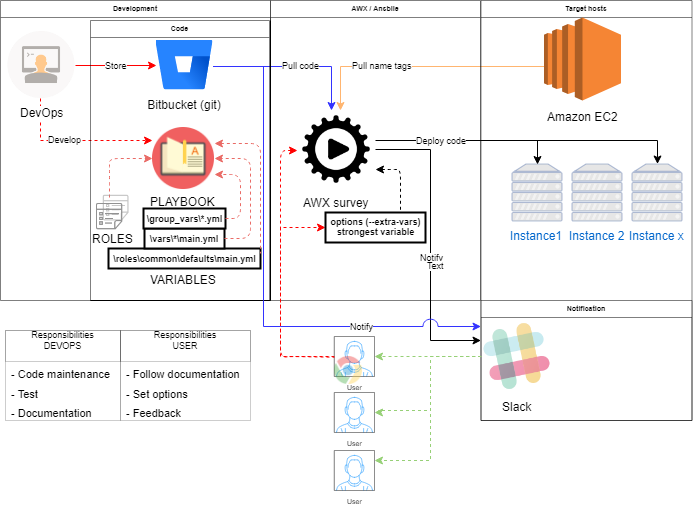
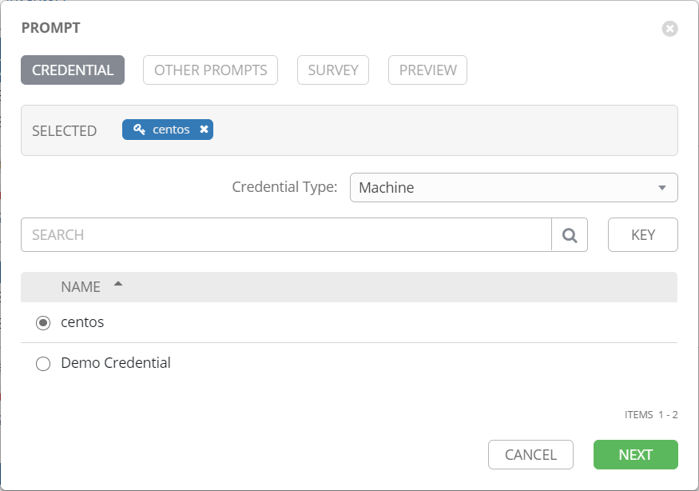
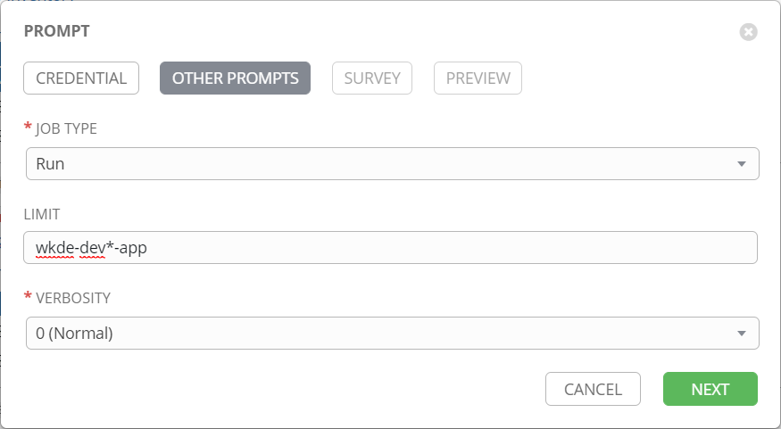
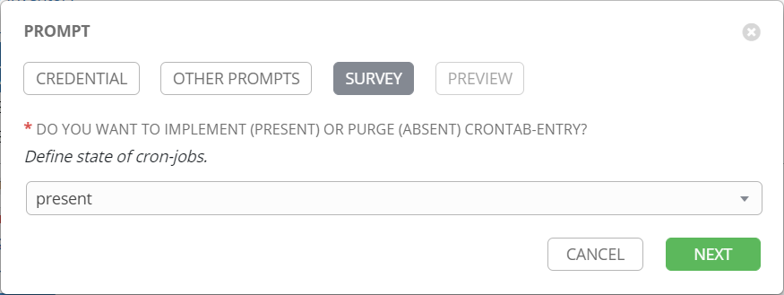
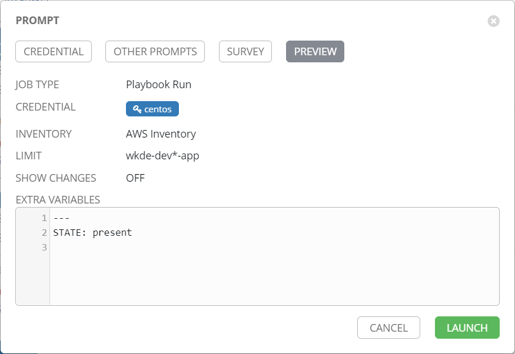
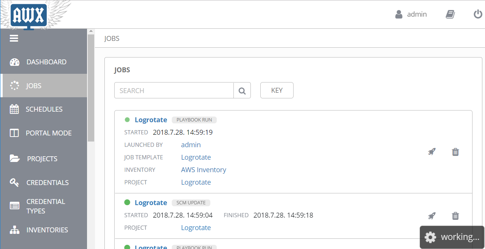
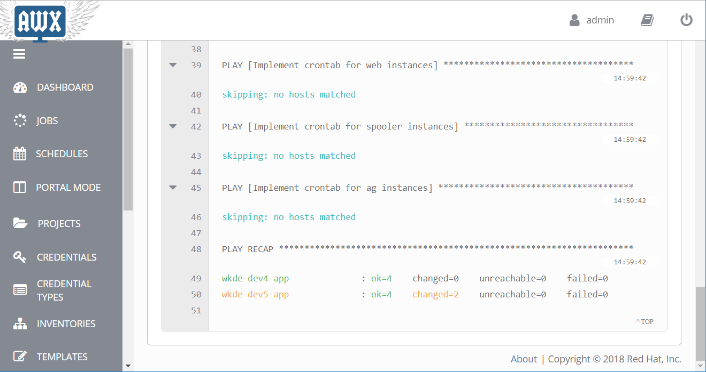
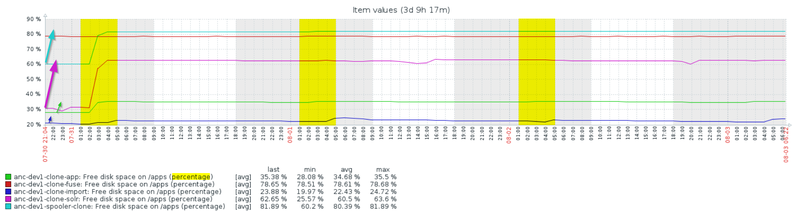
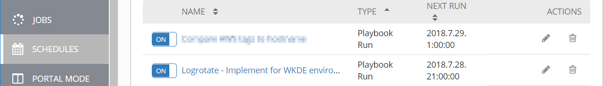
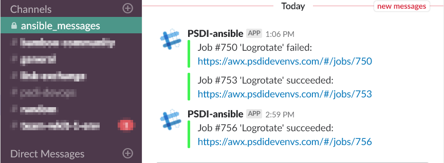

# Logrotate
This playbook implements:
 > Pre-defined **crontab entries** to target host for user who is owner of `COMPRESS_PATH` path (automatically detected by playbook).

 >> One of them is responsible to compress logs.
 
 >> Other delete compressed logs after defined time.

  > "Timeout" feature (4 days) was added for generated crontab-entries.
  `/bin/timeout -s 2 345600`

 >**Logrotated** configuration basically for system logs under root volume (/var/log/*)
 >> [wtmp/btmp](https://www.thegeekdiary.com/centos-rhel-how-to-rotate-varlogwtmp-and-varlogbtmp-file-using-logrotate/) files under /var/log/ 

_[JIRA - PKB-2973](https://jira.wolterskluwer.io/jira/browse/PKB-2973) - History of this script_

## Requirement (no any manual step required)
Developed to use with [AWX](https://confluence.wolterskluwer.io/display/PSI/Ansible+-+AWX).

### Playbook
logrotated handle
 > **reallyenglish.logrotate** (ansible-galaxy). Handled by playbook automatically.

### Inventory
 > Paybook used with AWX's dynamic cloud (amazon) inventory. You can find under "INVENTORIES/**AWS Inventory**" inside AWX.  all instance name converted from Upper-case to lower-case by Inventory.
 
### ansible
 > Installed **python** (2.5<) on target host.
 
 > **Ansible 2.5**< on source machine. /EXIST on AWX/

### OS
 > Tested with **CentOS 7**.
 
 > **SSH key** with sudo right. /EXIST on AWX/ (centos - PSDI key).

## Quick reference
**I recommend to read the whole documentation** for first time but for daily usage here is a quick reference:

1. **Login** to [AWX](https://awx.psdidevenvs.com).
2. On left panel **search for "TEMPLATES"** & click on it.
3. **Search for "Logrotate" job template** & click to rocket-icon on right side.
4. **Leave default** choose (centos) & click next.
5. **Fill up "LIMIT" (use lower-case)** with your pattern {eg.: run on all wkde-dev5-(cdc,import,app,...) instance --> wkde-dev5*}.
6. **Leave default** option (present) & click next.
7. Click to **lunch** button.
8. **Refresh the job page**. Expected running time (with ~10 affected instance) --> ~2mins.

## How it works (high level overview)

 
## Usage

In AWX, **template** with "**Logrotate**" name was defined. No any manual refresh need, it was configured to use latest version of source-code from git / bitbucket.

### Handled hosts:
Just linux (RHEL based) OS handled by playbook, **windows** hosts will **skipped**.

**Filtering** is based on **aws name tag**.

 > `hosts: "*-app*"`

 > `hosts: "*-cdc*"`

 > `hosts: "*-solr*"`

 > `hosts: "*-imp*"`

 > `hosts: "*-zoo*"`

 > `hosts: "*-pci2ga*"`

 > `hosts: "*-gpd*"`

 > `hosts: "*-fuse*"`

 > `hosts: "*-web*"`

 > `hosts: "*-spooler*"`

 > `hosts: "*-ag*"`

### Trigger it manually
click to "Lunch" button next to template & follow:


 > **Credential** which should be used to log in remote host. Pre-defined in AWX (PSDI-key --> centos)


 > **JOB TYPE**: You can check (dry-run) or run the playbook. For first usage recommended to choose "check" option to be sure your options will be applied with right settings on right hosts.
 
 > **LIMIT**: You can limit, which hosts will be affected.
 > > *-app --> Every host which's name (EC2 name tag) ending with app.
 
 > > wkde-dev* --> Every german environment host.
 
 > > wkde-dev*-solr --> Every german environment's solr host. 
 

 > **VERBOSITY**: Control verbose-level of playbook.
 
 

 > **Define state of cron-jobs**: 
 > > present --> Implement or update playbook managed cron-jobs.
 
 > > absent --> Remove playbook managed cron-jobs if exist.

 

 > Summary of settings. Last step before you run playbook.
 



 > You can check job's status under "JOBS".

### Result

#### crontab entry:
similar like:
```sh
[jbossuser@wkde-dev4-solr ~]$ crontab -l
#Ansible: Compress logs
0 22 * * * /bin/timeout -s 2 345600 find "/apps/logs/" -iname "*log*" -a -not -iname "*.gz" -mtime +7   -exec /bin/gzip -r -f {} \; > /dev/null 2>&1
#Ansible: Delete old logs
0 23 * * * /bin/timeout -s 2 345600 find "/apps/logs/" -iname "*log*" -a -iname "*.gz" -mtime +50   -exec /bin/rm {} \; > /dev/null 2>&1
```

#### logrotated:
check "/etc/logrotate.conf" file & "/etc/logrotate.d/*" folder. Managed files have the following mark at the beggining of file:
```
# Generated by ansible logrotate module
...
```

**Expected result on managed hosts:**



### Variables
**Variables defined host variable level**, can be overwritten as group var / extra option.
 > `STATE`: "present" - implement / update ansible managed cron-jobs & logrotated config, or "absent" - remove ansible managed cron-jobs & logrotated config.
  >> for crontab & logrotated
 
 > `COMPRESS_PATH`: Define **path** where cron-job's task (find && gzip) will be applied.
 >> for crontab & logrotated
 
 > `PATH_EXCLUDE`: **Exclude path** for cron-job's task (find && gzip / && rm).
 >> for crontab
 
 > `COMPRESS_PATTERN`: Define **pattern** for cron-job's task (find && gzip).
 >> for crontab
 
 > `COMPRESS_RETENTION`: Define **retention time** of compress in **day(s)**.
 >> for crontab
 
 > `DELETE_PATTERN`: Define **pattern** for cron-job's task (find && rm).
 >> for crontab
 
 > `DELETE_RETENTION`: Define retention time of delete in **day(s)**.
 >> for crontab
 
 > `ROTATE`: Define **how many rotate** will be kept by logrotated (if daily, ROTATE:30 --> ~1 month)
 >> for logrotated

#### Runtime dynamic variables:
 > `owner.stat.pw_name`: Used to determinate the owner of `COMPRESS_PATH`. This variable responsible to auto-detect which user's crontab will contain crontab-entires.
 >> Used by crontab
 
#### Default values:
```
STATE: present
COMPRESS_PATH: /apps/logs/
PATH_EXCLUDE: '-not -path "/apps/logs/apache/*"'
COMPRESS_PATTERN: '*log*'
COMPRESS_RETENTION: 7
DELETE_PATTERN: '*log*'
DELETE_RETENTION: 50
ROTATE: 30
```
 
### Roles
Following roles prepared:
 > logrotated: implemented logrotate configuration.
 
 > crontab: Implement crontab-entries.
 
### Scheduled by AWX


## Notification
In AWX, slack notification was implemented. Job will send result (failed / success) to _wk-dev-community.slack.com / ansible_messages channel_



## FAQ:
What about if I run playbook multiple-times on the same group of host?
 > For first time playbook implement settings to target machines. Any further run has no effect (no file-change).
 
Can I edit ansible managed files manually?
 > Yes, you can, but why? If something wrong on it, improve the code. If you run playbook on target machine it will overwrite your hand-made changes.
 
If I choose "absent" as state, what will be deleted?
 > Just ansible managed settings / configs. For example: Just ansible-managed crontab-entries will be deleted, others remains.
 
Can I revert changes by ansible playbook in case of mistake (like wrong group of hosts, etc...)?
 > Yes, just run playbook on same group of host with "absent" state.

License
-------

MIT

Author Information
------------------

PSDI DevOps team / Peter Mikaczo <Peter_Mikaczo@epam.com>