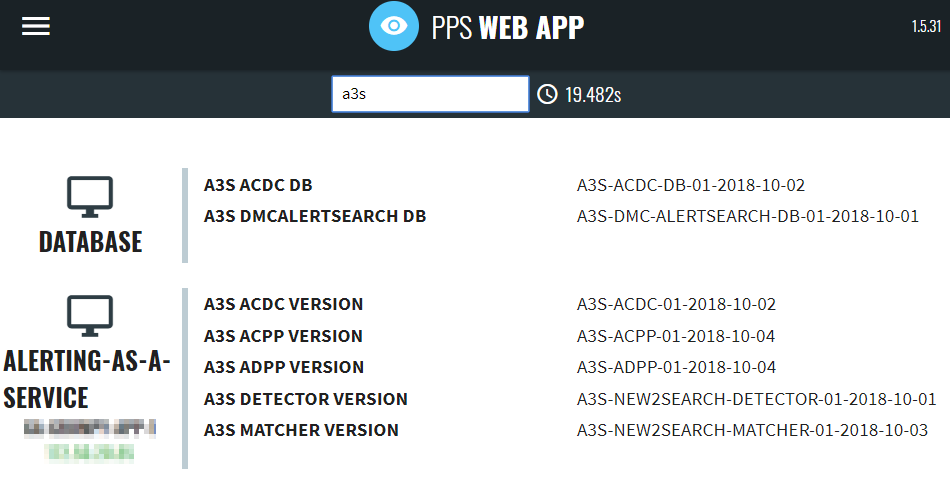
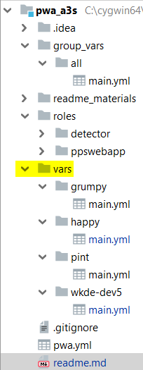

# PWA A3S check


This playbook implements Alerting As A Service (A3S)'s component checks to PWA.
 > Detect where ppswebapp is installed (Prepared to handle multi-tenant too).

 > ppswebapp configuration-file modification.

 > ppswebapp (compatible) version check.

 > ppswebapp restart if required.

_[JIRA - PKB-3146](https://jira.wolterskluwer.io/jira/browse/PKB-3146) - History of this script_

## Requirement(s)
 (no any manual step required)
Developed to use with [AWX](https://confluence.wolterskluwer.io/display/PSI/Ansible+-+AWX).

### Inventory
 > Paybook used with AWX's dynamic cloud (amazon) inventory. You can find under "INVENTORIES/**AWS Inventory**" inside AWX.
 
### ansible 
 > **Ansible 2.5**< on source machine. /EXIST on AWX/

### OS
 > Tested with **CentOS 7**.
 
 > **SSH key** with sudo right. /EXIST on AWX/ (centos - PSDI key).

## Quick reference
For daily usage here is a quick reference:

1. **Login** to [AWX](https://awx.psdidevenvs.com).
2. On left panel **search for "TEMPLATES"** & click on it.
3. **Search for "pwa_a3s" job template** & click to rocket-icon on right side.
4. **Leave** selection on **default (centos)**.
5. **Fill up "LIMIT"** with your pattern {eg.: run on all wkde-dev5-(cdc,import,app,...) instance --> wkde-dev5*}
6. Click to **lunch** button.
7. **Refresh the job page**. Expected running time (with 4 A3S check implementation)is: < 5mins.

### Handled hosts:
Just linux (RHEL based) OS handled by playbook, **windows** hosts will **fail**.

**Filtering** is based on **aws name tag**.

### Roles
Following roles was prepared:
 > detector: Detect where ppswebapp application is exist.
 
 > ppswebapp: Implement ppswebapp related changes and handler for ppswebapp restart.

## HowTo: Add new A3S endpoint

### Add variables
Add new folder with environment name && add main.yml file (copy an existing one)



Fill up **main.yml** with A3S enviroment's details:

You can collect required information in AWS "Cloudformation" stack's output tab.

Passwords for databases are exist in the code of A3S (`mtdtdbconfig.json` and `Acdc-config.json`)

 > `A3S_ACDC_LB`: Load balancer DNS name of ACDC component endpoint.

 > `A3S_MATCHER_LB`: Load balancer DNS name of MATCHER component endpoint.

 > `A3S_DETECTOR_LB`: Load balancer DNS name of DETECTOR component endpoint.

 > `A3S_ADPP_LB`: Load balancer DNS name of ADPP component endpoint.

 > `A3S_ACPP_LB`: Load balancer DNS name of ACPP component endpoint. Usually same as ADPP (two task definition behind the same ECS instance & load balancer)

 > `A3S_ACDC_DB_URL`: DB URL of ACDC endpoint.

 > `A3S_DMCALERTSEARCH_DB_URL`: DB URL of DMCALERTSEARCH endpoint.

 > `A3S_ACDC_DB_PASSWORD`: Password for ACDC DB.

 > `A3S_DMCALERTSEARCH_DB_PASSWORD`: Password for DMCALERTSEARCH DB.

### Add to playbook

Add as next entry in "pwa.yml":
```
- name: Implement A3S entry to PWA - YOUR_NEW_A3S
   hosts: "YOUR_NEW_A3S_PWA_DESTINATION_AWS_HOST_NAME"
   become: True
   gather_facts: no
   roles:
     - detector
   pre_tasks:
     - include_vars:
         dir: vars/YOUR_NEW_A3S_VARS/
```

License
-------

MIT

Author Information
------------------

PSDI DevOps team / Peter Mikaczo <Peter_Mikaczo@epam.com>