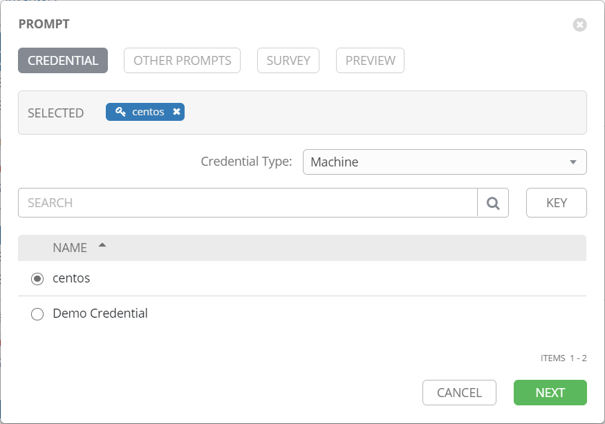
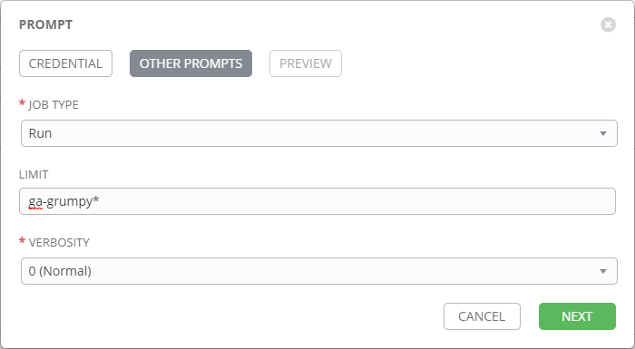
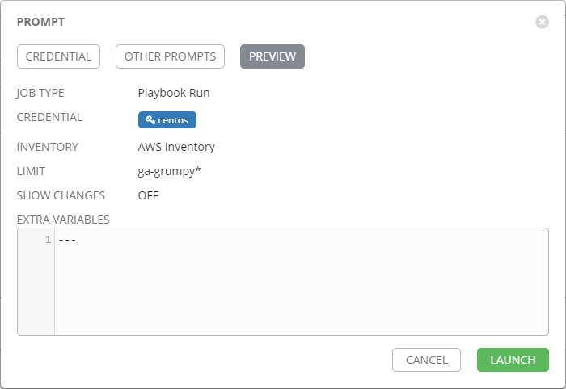
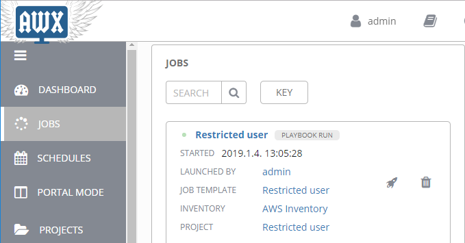
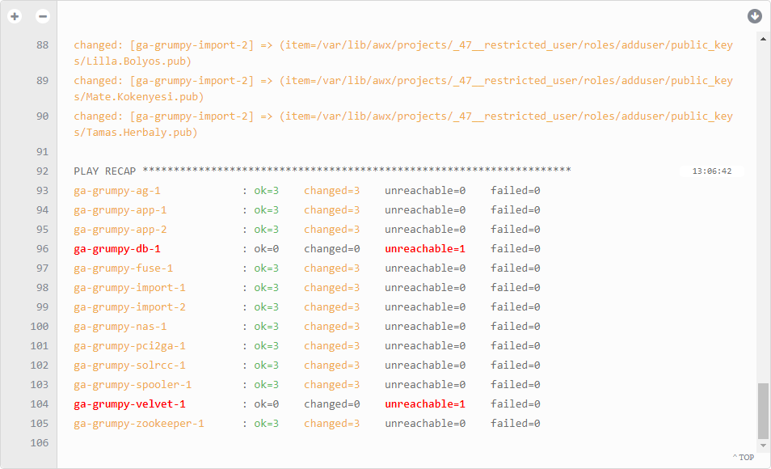

# Restricted user implementation playbook
It is a fast-developed solution to broadcast restricted users to defined (limited) environments on AWS (linux) instances.

_[JIRA - GRUMPY-172](https://jira.wolterskluwer.io/jira/browse/GRUMPY-172) - History of this request_


This playbook implements:
 > Create (if not exist) new user and group.
 >> **user** :`restricteduser`

 >> **group**: `readonly`.

 > Create / append stored public SSH keys for `restricteduser` user.
 >> Stored inside this playbook as "roles/public_keys/*.pub"

## Requirement (no any manual step required)
Developed to use with [AWX](https://confluence.wolterskluwer.io/display/PSI/Ansible+-+AWX).

### Inventory
 > Paybook used with AWX's dynamic cloud (amazon) inventory. You can find under "INVENTORIES/**AWS Inventory**" inside AWX.

### ansible
 > Installed **python** (2.5<) on target host.

 > **Ansible 2.5**< on source machine. /EXIST on AWX/

### OS
 > Tested with **CentOS 7**.

 > **SSH key** with sudo right. /EXIST on AWX/ (centos - PSDI key).

## Quick reference
Here is a quick reference for usage:

1. **Login** to [AWX](https://awx.psdidevenvs.com).
2. On left panel **search for "TEMPLATES"** & click on it.
3. **Search for "Restricted user" job template** & click to rocket-icon on right side of it.
4. **Leave default** choose (centos) & click next.
5. **Fill up "LIMIT"** with your pattern {eg.: run on all wkde-dev5-(cdc,import,app,...) instance --> wkde-dev5*}
6. Click to **launch** button.
7. **Refresh the job page**. Expected running time (with ~10 affected instance) --> ~2mins.


## Usage

In AWX, **template** with "**Restricted user**" name was defined. No any manual refresh need, it was configured to use latest version of source-code from git / bitbucket.

### Handled hosts:
Just linux (RHEL based) OS handled by playbook, **windows** hosts will **skipped**.

**Filtering** is based on **aws name tag**.

### Trigger it manually
click to "Lunch" button next to template & follow:


 > **Credential** which should be used to log in remote host. Pre-defined in AWX (PSDI-key --> centos)


 > **JOB TYPE**: You can check (dry-run) or run the playbook. For first usage recommended to choose "check" option to be sure your options will be applied with right settings on right hosts.

 > **LIMIT**: You can limit, which hosts will be affected.
 > > *-app --> Every host which's name (EC2 name tag) ending with app.

 > > wkde-dev* --> Every german environment host.

 > > wkde-dev*-solr --> Every german environment's solr host.


 > **VERBOSITY**: Control verbose-level of playbook.



 > Summary of settings. Last step before you run playbook.




 > You can check job's status under "JOBS".

### Result

```sh
[root@ga-grumpy-app-1 centos]# id restricteduser
uid=5000(restricteduser) gid=1006(readonly) groups=1006(readonly)

[root@ga-grumpy-app-1 centos]# ll /home/ | grep rest
drwx------.  3 restricteduser readonly   88 Jan  4 12:06 restricteduser

[root@ga-grumpy-app-1 .ssh]# cat /home/restricteduser/.ssh/authorized_keys
ssh-rsa *******************************
ssh-rsa *******************************
ssh-rsa *******************************
ssh-rsa *******************************
ssh-rsa *******************************
```


### Variables
It is a rapid developed tiny playbook. ATM no any variable used.


### Roles
Following role(s) prepared:
 > adduser: At the moment this role handle aff of required task. Should be separated in the future in case of new features.


### Scheduled by AWX
No schedule was applied for this playbook.

## Howto

### Add user
Just simply add (as the same format) affected user's public key under **"/roles/adduser/public_keys/xyz.pub"** path.

## Notification
In AWX, slack notification was implemented BTW job was not configured to send result to it. If required, can be configured.

## FAQ:
What about if I run playbook multiple-times on the same group of host?
 > For first time playbook implement settings to target machines. Any further run has no effect (no file-change).

Can I edit ansible managed files manually?
 > Yes, you can, but why? If something wrong on it, improve the code. If you run playbook on target machine it will overwrite your hand-made changes.


License
-------

MIT

Author Information
------------------

PSDI DevOps team / Peter Mikaczo <Peter_Mikaczo@epam.com>